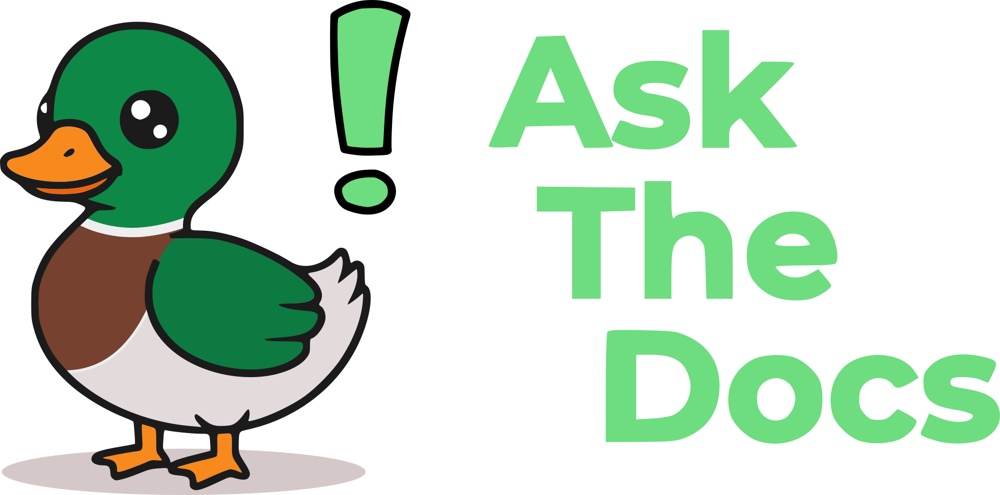

<p align="center">
  
</p>


<p align="center">
  <!-- Technologies -->
  
  
  
  <!-- CI -->
  
  
  
  <!-- License -->
  
</p>

# AskTheDocs 🦆

**AskTheDocs 🦆** leverages LLMs and AI to allow users to upload and query documents in a simple and easy-to-use UI. Once documents are uploaded, users can ask questions in a Chatbot interface.

All the components of the application are containerized with Docker, so that they can be easily deployed in any environment. For production deployment we recommend using a Kubernetes cluster, but for a quick start you can use Docker Compose.

**Getting started is extremely easy!**

## Getting Started

### Docker Setup

Each component of **AskTheDocs 🦆** is containerized with Docker. So the only requirement you need to have installed on your system is Docker, nothing else!

If you want to use Docker Compose (recommended), make sure that your system has Docker installed and running. If you are running on your local machine, you can [install Docker Desktop](https://docs.docker.com/desktop/).

### OpenAI Setup

**AskTheDocs 🦆** uses AI in the background in several points.
- **Parsing** — AI models are used to extract text from documents. Free models are downloaded and used by default, so no setup is required.
- **Embedding** — AI models are used to embed text into vectors. OpenAI API for Embeddings is used for this purpose.
- **Text Generation** — AI models are used to generate answers to user questions. OpenAI API for Text Generation is used for this purpose.

As one can see, in two different points we are using the OpenAI API. For this reason, you need to be able to use OpenAI API. You can sign up for OpenAI API usage at [OpenAI](https://platform.openai.com/signup), fill up your billing information, and get your API key. Copy your API key and save it safely, you will need it in the next step!

### Env Variables

Before running the application, we need to export some environment variables. You can do this manually by running the following commands in your terminal:

```bash
export OPENAI_API_KEY="sk-9Q..."  # Replace with your OpenAI API key obtained in previous step!
export POSTGRES_USER=myuser
export POSTGRES_PASSWORD=mypassword
export POSTGRES_DB=mydatabase
```

As an alternative you can `cp .env.example .env` and fill in the values in the `.env` file. Then you can run `source .env` to export the variables, or you can use [`direnv`](https://direnv.net/) to automatically load the variables when you enter the directory.

### Running the Application

We are now ready to launch **AskTheDocs 🦆**! You can use Docker Compose to build and run it.

```bash
docker-compose up --build
```

Now, you should be able to access the application at [http://localhost:8501](http://localhost:8501).

## How Does It Work?

### RAG Architecture 

**AskTheDocs 🦆** uses the RAG architecture to provide answers to user questions. There are mainly two phases of RAG.

- **1. Document Upload**
  - Text is extracted using OCR when needed using [`docling`](https://github.com/DS4SD/docling).
  - The document is split into chunks using [Hybrid Chunking](https://ds4sd.github.io/docling/examples/hybrid_chunking/).
  - Each chunk is turned into a vector using [OpenAI Embeddings API](https://platform.openai.com/docs/guides/embeddings).
  - These vectors are saved in [PostgreSQL with `pgvector` extension](https://github.com/pgvector/pgvector).
- **2. Asking a Question**
  - The question is turned into a vector using [OpenAI Embeddings API](https://platform.openai.com/docs/guides/embeddings).
  - We search for the most similar chunks in the database using [`pgvector` SLQ queries](https://github.com/pgvector/pgvector).
  - We send the question and similar chunks to [OpenAI Text Generation API](https://platform.openai.com/docs/guides/text-generation)
  - We get a JSON response with (i) answer text and (ii) answer sources leveraging [OpenAI Structured Output](https://platform.openai.com/docs/guides/structured-outputs).

### Components

The application is divided into three main components. Each component is containerized with Docker for easy deployment.

- **1. Frontend**
  - Built with Streamlit, provides an easy-to-use UI for users to upload documents and ask questions in a Chatbot interface.
  - We may switch to React or another framework in the future.
- **2. Backend**
  - Built with FastAPI.
  - Handles calls to the database and OpenAI.
  - Provides endpoints for the frontend.
- **3. Database**
  - PostgreSQL with the `pgvector` extension.
  - Stores chunks and their embeddings for fast similarity lookups.
  